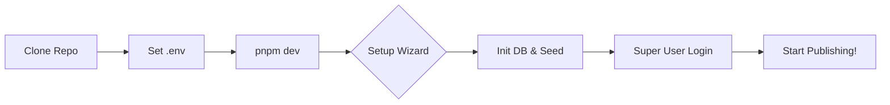

# 🕊️ MERPATI CMS


### The Ultimate Serverless WordPress Alternative for Modern Publishers

[](https://vercel.com)
[](https://nextjs.org)
[](https://tailwindcss.com)

**Media Editorial Ringkas, Praktis, Aman, Tetap Independen**
> *"Press freedom starts with infrastructure independence."*

MERPATI is a radical, high-performance publishing platform designed to eliminate hosting costs while delivering a premium WordPress-like experience. Built for the serverless era, it runs entirely on the **Vercel Free Tier** using a single-endpoint architecture.

---

## 🚀 Why MERPATI?

- **⚡ Blazing Fast Performance**: Zero-overhead React Server Components (RSC) ensure sub-200ms page loads.
- **💰 Honestly Free**: Designed to stay within Vercel's Free Tier forever. No hidden database costs with Neon.
- **📱 Mobile-First Radicalism**: A dashboard and public interface built first for the thumb, then for the desk.
- **🛡️ Secure by Design**: Post-legacy architecture with Google OAuth 2.0 and strict HTML sanitization.
- **📈 Native SEO Power**: Automated JSON-LD, Sitemaps, and RSS feeds to dominate search rankings.

---

## ✨ Features at a Glance

| Feature | Description |
|---|---|
| **📝 Classic Editor** | Familiar WYSIWYG writing with HTML toggle & robust autosave. |
| **🖼️ Media Library** | Instant Vercel Blob uploads or remote URL integration. |
| **🎨 Modular Themes** | Isolated `/themes` directory for infinite design freedom. |
| **👤 Invite-Only Auth** | Secure author management via Google OAuth. |
| **🧭 Menu Manager** | Intuitive drag-and-drop navigation builder. |
| **🔔 Push Alerts** | Real-time Telegram notifications for posts and users. |

---

## 🛠️ Getting Started in 60 Seconds

MERPATI features a **"Zero-Touch"** initialization flow. No CLI migrations or complex terminal commands required.

### 1. Simple Deployment Flow



### 2. Prerequisites
- Node.js 18+ & `pnpm`
- [Neon.tech](https://neon.tech) (Free Serverless Postgres)
- [Google Cloud](https://console.cloud.google.com) (OAuth Credentials)
- [Vercel Blob](https://vercel.com/docs/storage/vercel-blob) (Optional for production media)

### 3. Quick Install
```bash
git clone https://github.com/arinadi/MERPATI-CMS.git
cd MERPATI-CMS
pnpm install
cp .env.example .env.local # Fill in your credentials
pnpm dev
```
Visit `http://localhost:3000` to launch the **Automatic Setup Wizard**.

---

## 🏗️ Technical Architecture

MERPATI is built for the edge:
- **Framework**: Next.js 15 (App Router)
- **Database**: Neon (Serverless Postgres over HTTP)
- **ORM**: Drizzle (Ultra-lightweight)
- **Styling**: Tailwind CSS v4 + shadcn/ui
- **Auth**: Auth.js v5 (JWT Strategy)

---

## 📁 Project Philosophy

We separate **Admin Productivity** from **Public Performance**:
- **Admin (`/admin`)**: A rich, interactive SPA-like experience using `shadcn/ui`.
- **Public (`/themes`)**: Pure Tailwind CSS v4 and RSC for a near-zero JavaScript footprint.

---

## 📄 License
MIT © 2024 MERPATI CMS Project.

*Build it fabulously. Keep it independent.*
